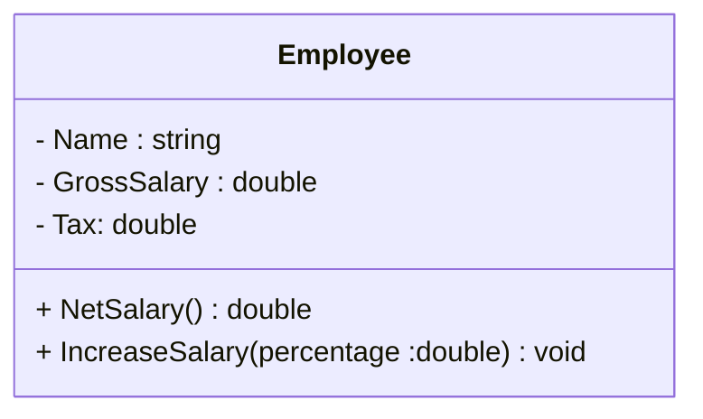

# Exercício 2 Orientação Objeto

Fazer um programa para ler os dados de um funcionário (nome, salario bruto e impsoto). Em seguida mostar os dados do funionário (nome e salário líquido). Em seguida, aumentar o salário do funcionário com base em uma porcentagem dada (somente o salario bruto é afetado pela porcentagem) e mostrar novamente os dados do funcionário. Use as classe projetada abaixo.

