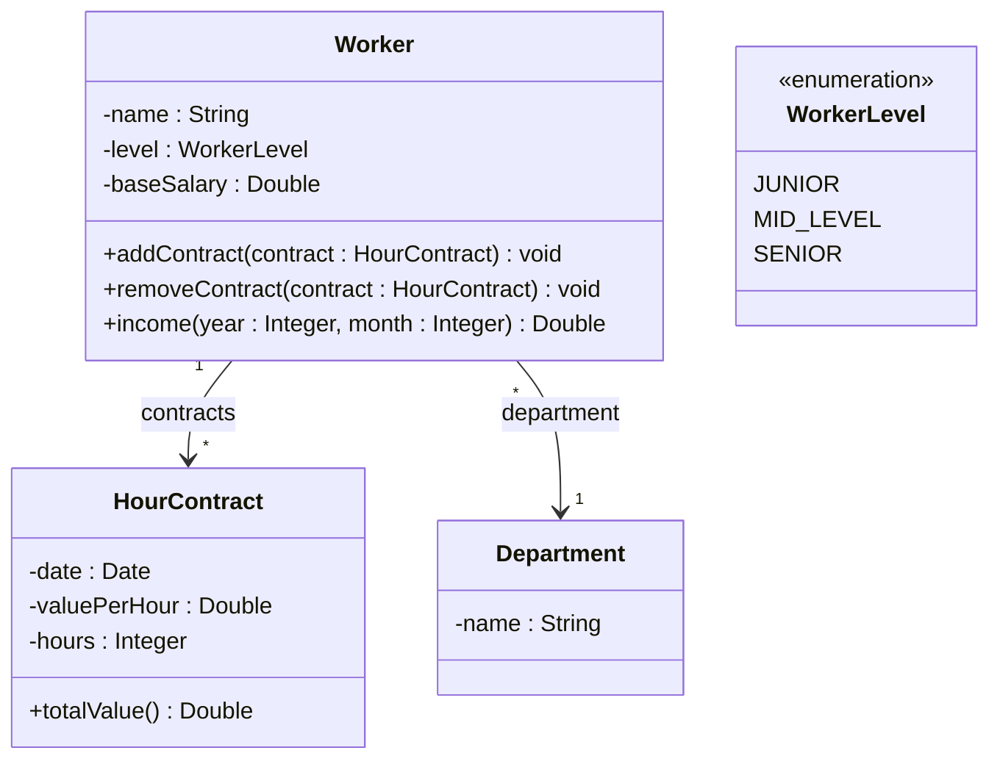

```mermaid
classDiagram
class Worker {
    -name : String
    -level : WorkerLevel
    -baseSalary : Double
    +addContract(contract : HourContract) void
    +removeContract(contract : HourContract) void
    +income(year : Integer, month : Integer) Double
}

class HourContract {
    -date : Date
    -valuePerHour : Double
    -hours : Integer
    +totalValue() Double
}

class Department {
    -name : String
}

class WorkerLevel {
    <<enumeration>>
    JUNIOR
    MID_LEVEL
    SENIOR
}

Worker "1" --> "*" HourContract : contracts
Worker "*" --> "1" Department : department
```