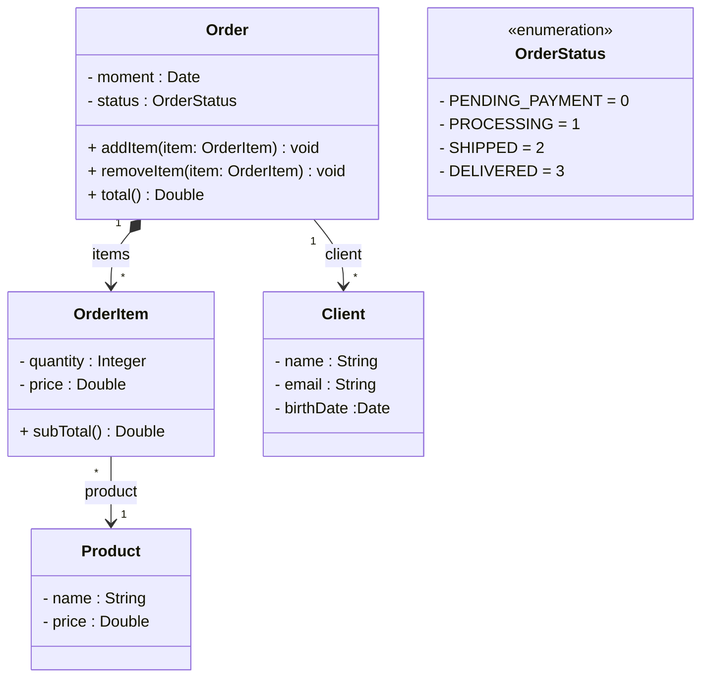

## Diagrama de Classes UML

```mermaid
classDiagram
    class Order {
        - moment : Date
        - status : OrderStatus 
        + addItem(item: OrderItem) void
        + removeItem(item: OrderItem) void
        + total() Double
    }

    class OrderItem {
        - quantity : Integer 
        - price : Double 
        + subTotal() Double
    }

    class Product {
        - name : String 
        - price : Double 
    }

    class Client {
        - name : String 
        - email : String 
        - birthDate :Date 
    }

    class OrderStatus {
        <<enumeration>>
        - PENDING_PAYMENT = 0
        - PROCESSING = 1
        - SHIPPED = 2
        - DELIVERED = 3
    }

    Order  "1" --> "*"  Client: client
    Order "1" *--> "*" OrderItem : items
    OrderItem "*" --> "1" Product : product
    
```
