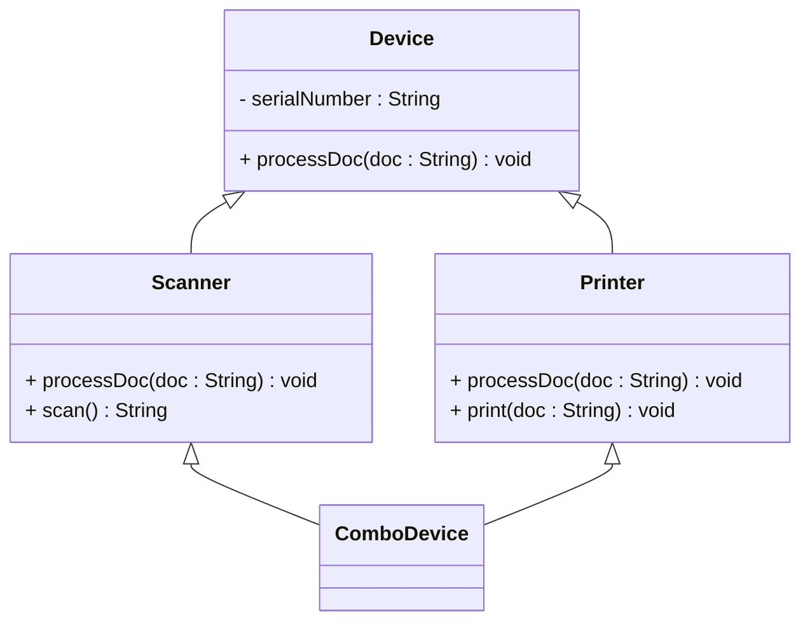
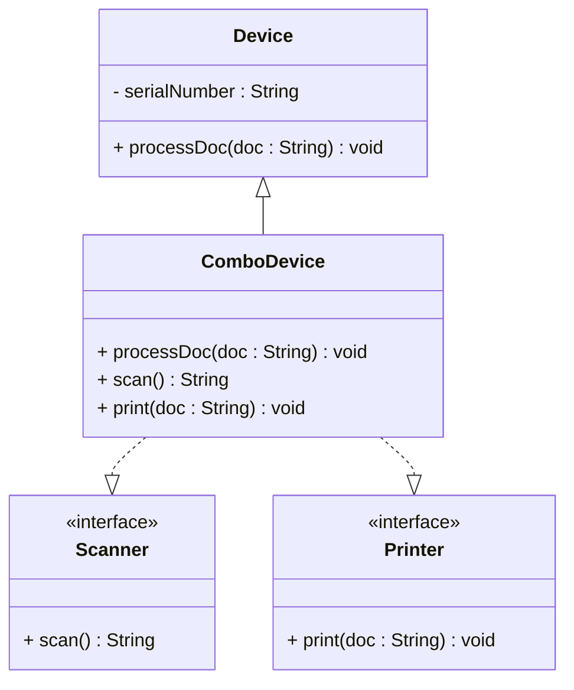

HERANÇA MULTIPLA

Antes

```mermaid
classDiagram
    class Device {
        - serialNumber : String
        + processDoc(doc : String) void
    }

    class Scanner {
        + processDoc(doc : String) void
        + scan() String 
    }

    class Printer {
        + processDoc(doc : String) void
        + print(doc : String) void
    }

    class ComboDevice {
    }


    Device <|-- Scanner
    
    Device <|-- Printer

    Scanner <|-- ComboDevice

    Printer <|-- ComboDevice

```

Depois

```mermaid
classDiagram
    class Device {
        - serialNumber : String
        + processDoc(doc : String) void
    }

    class Scanner {
        <<interface>>
        + scan() String 
    }

    class Printer {
        <<interface>>
        + print(doc : String) void
    }

    class ComboDevice {
        + processDoc(doc : String) void
        + scan() String
        + print(doc : String) void
    }


    Device <|-- ComboDevice

    ComboDevice ..|> Scanner

    ComboDevice ..|> Printer

```