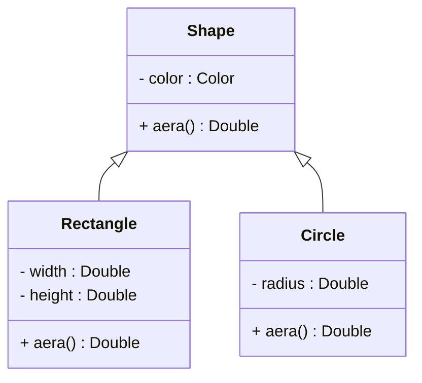
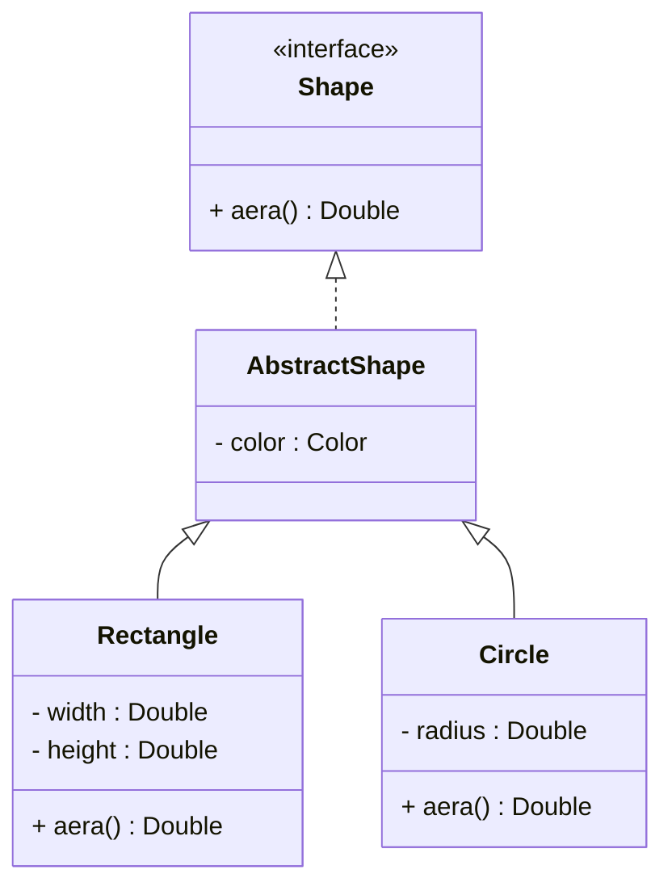

BEFORE

```mermaid
classDiagram
    class Shape {
        - color : Color
        + aera() Double
    }

    class Rectangle {
        - width : Double
        - height : Double
        + aera() Double
    }

    class Circle {
        - radius : Double
        + aera() Double
    }


    Shape <|-- Rectangle

    Shape <|-- Circle
```
AFTER

```mermaid
classDiagram
    class AbstractShape {
        - color : Color
    }

    class Rectangle {
        - width : Double
        - height : Double
        + aera() Double
    }

    class Circle {
        - radius : Double
        + aera() Double
    }

    class Shape {
        <<interface>>
        + aera() Double
    }


    AbstractShape <|-- Rectangle

    AbstractShape <|-- Circle
    
    Shape <|.. AbstractShape
```